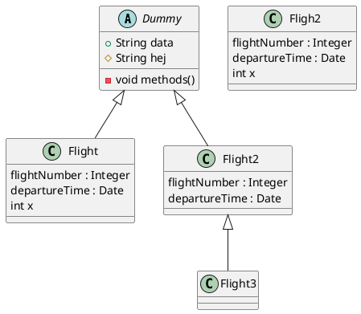

```plantuml
@startuml component
Abstract class Dummy {
  +String data
  -void methods()
  #String hej
}
Dummy <|-- Flight
Dummy <|-- Flight2

Flight2 <|-- Flight3

class Flight{
  {field} flightNumber : Integer
   departureTime : Date
    int x
}

class Fligh2{
  {field} flightNumber : Integer
   departureTime : Date
    int x
}

class Flight2{
  {field} flightNumber : Integer
   departureTime : Date
}
    
@enduml
```