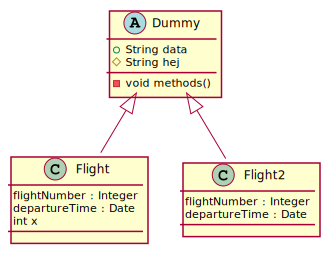

## Solution
----
```C++

int main()
{
    JSON_Object obj1 {};

    lookup(obj1, "null") = create_null();
    lookup(obj1, "string") = create_string("my string");
    lookup(obj1, "number") = create_number(3.14);


}
```
## uml: sequence diagram


